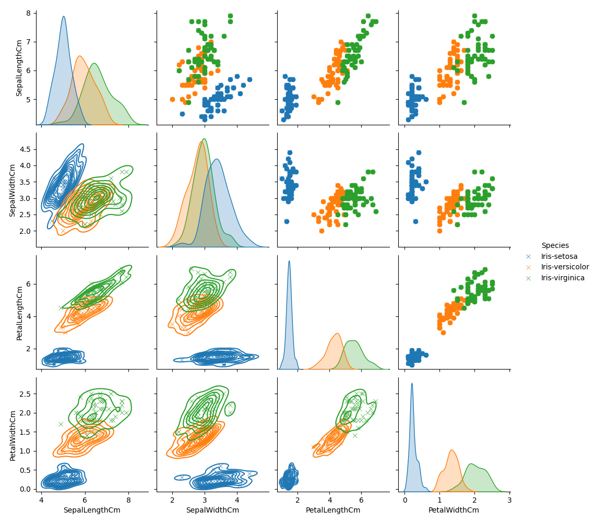

Построение моделей линейной и логистической регрессии для датасета Iris (https://www.kaggle.com/datasets/uciml/iris)

Визуализация исходных данных:
.

Разделяющая прямая для линейной регрессии без регуляризации модели:

Разделяющая прямая для линейной регрессии с L2-регуляризацией, alpha=600.0:

ROC-AUC кривая:

AUC: 0.958
